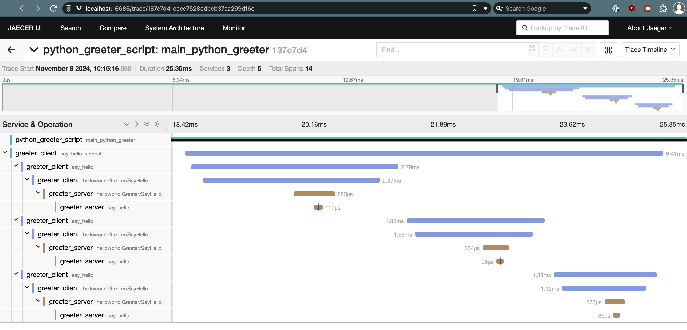

# rust-tonic-tracing-otel

Example of setting up Opentelemetry in a distributed Python / Rust gRPC client / server setup and collecting the traces via OTLP.

Consists of four parts that we will observe a trace across:
* A Rust gRPC server (/crates/greeter-server)
* A Rust gRPC client (/crates/greeter-client)
* A Python library that wraps the Rust gRPC client using pyo3 (/crates/pygreter)
* An outer Python script that invokes the gRPC server and retrieves a response via the wrapped pyo3 library (/greeter.py)


# Setup

### 2. Start a local Jaeger instance
```bash
ocker run --rm --name jaeger \
  -e COLLECTOR_ZIPKIN_HOST_PORT:9411 \
  -e COLLECTOR_OTLP_ENABLED:true \
  -p 6831:6831/udp \
  -p 6832:6832/udp \
  -p 5778:5778 \
  -p 16686:16686 \
  -p 4317:4317 \
  -p 4318:4318 \
  -p 14250:14250 \
  -p 14268:14268 \
  -p 14269:14269 \
  -p 9411:9411 \
  jaegertracing/all-in-one:1.49
```

### 3. Start the Greeter Server
```bash
export OTEL_EXPORTER_OTLP_TRACES_ENDPOINT=http://localhost:4317 
cargo run -p greeter-server                                                                            
```

### 4. Run the example python script
```bash
cd crates/pygreeter
uv sync # I'm using uv here to manage the python deps. You can use something else if you're not as cool. This will create the venv and install the deps
source .venv/bin/activate
maturin develop --uv # (skip the --uv flag if you're using traditional tooling) See https://www.maturin.rs
export OTEL_EXPORTER_OTLP_TRACES_ENDPOINT=http://localhost:4317
python greeter.py # NB this will delay exiting for 6s to ensure that all OTLP traces get flushed to JAeger
```

### 5. View the Trace in Jaeger
Browse to http://localhost:16686/
